---
# You can also start simply with 'default'
theme: seriph
# random image from a curated Unsplash collection by Anthony
# like them? see https://unsplash.com/collections/94734566/slidev
# some information about your slides (markdown enabled)
title: Welcome to Slidev
info: |
  ## Slidev Starter Template
  Presentation slides for developers.

  Learn more at [Sli.dev](https://sli.dev)
# apply unocss classes to the current slide
class: text-center
# https://sli.dev/features/drawing
drawings:
  persist: false
# slide transition: https://sli.dev/guide/animations.html#slide-transitions
transition: slide-left
# enable MDC Syntax: https://sli.dev/features/mdc
mdc: true
# take snapshot for each slide in the overview
overviewSnapshots: true
---

# ネットワーク

---

# ネットワークを学ぶメリット

- コンピューターがどのように通信するか理解できる
- クラウド（AWS とか, GPC など）を理解できる
- Docker コンテナーのコミュニケーションを理解できる

<br>

その他にも, たくさんのメリットがある

---


<style>
img {
  position: absolute;
  top: 0;
  left: 0;
  width: 100%;
  height: auto;
}
</style>

---

# ネットワークとは？

複数のデバイスを接続して, 相互に通信できるようにするシステム

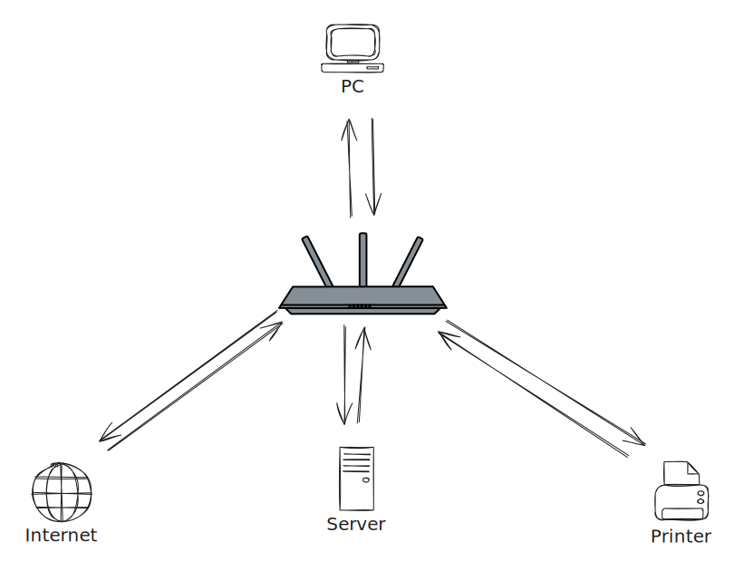

<style>
img {
  width: 400px;
  height: 400px;
}
</style>

---

<div>コンピューター, デバイス などは 1, 0 しか理解できない</div>

<arrow v-click v-bind="{ x1:100, y1:80, x2:100, y2:130}" />

<br v-after>
<br v-after>
<br v-after>
<div v-after>1, 0 からデータを人間に理解できるデータを交換するプロトコルが必要</div>

<arrow v-click v-bind="{ x1:100, y1: 180, x2: 100, y2: 230 }" />

<br v-after>
<br v-after>
<br v-after>
<div v-after>OSI モデル (TCP/IP モデル)</div>

---

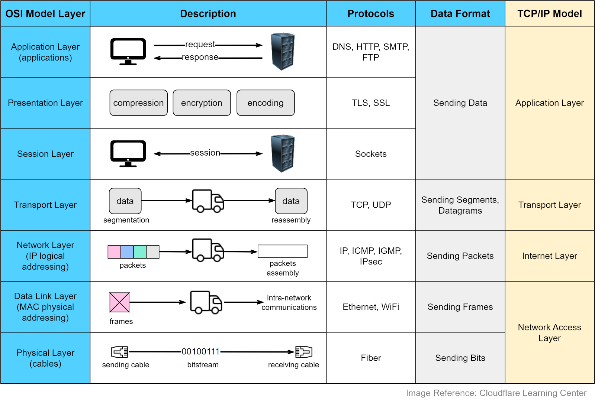

<style>
  img {
    position: absolute;
    top: 0;
    left: 0;
    width: 100%;
    height: 100%;
  }
</style>

---

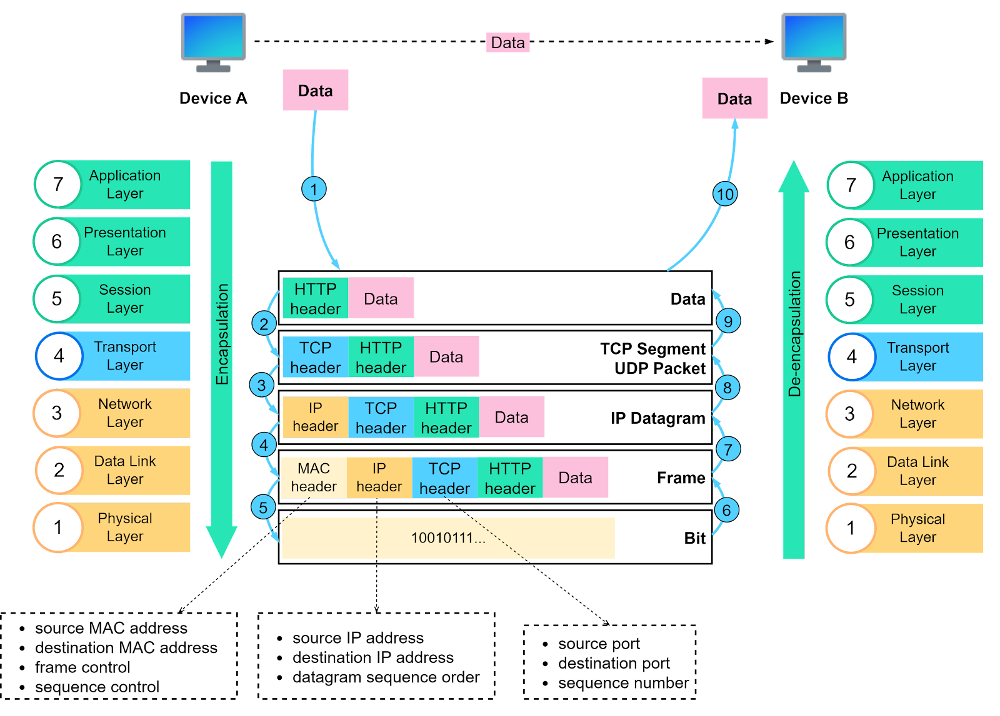

<style>
  img {
    position: absolute;
    top: 0;
    left: 0;
    width: 100%;
    height: 100%;
  }
</style>

---

# IP アドレス

- IP アドレスはどこにデータを送信するかを決定
- IP アドレスはデバイスのアドレスを表すだけではなく, ネットワークのアドレスも表す
- 2 種類
  - IPv4 192.168.0.100 (32bit)
  - IPv6 FD3B:FI5C:C672:34B8::100 (128bit)

---

# IPv4

<div class="pb-4">IPアドレスは１つに２つのアドレスがある</div>

<div class="text-center text-6xl">
  <span class="text-red-300">192.168</span>.<span class="text-teal-300">0.100</span>
</div>

<div class="absolute left-86 flex px-4 gap-24 pb">
  <div class="text-red-300 text-xl">ネットワーク</div>

  <div class="text-teal-300 text-xl">ホスト</div>
</div>

---

# CIDR (サブネットマスク)

２つのIPあどれすを使って, ネットワークとホストを分ける

<div v-click="1" class="text-center text-5xl pb-4">
  192.168.0.100
</div>

<div class="text-center flex flex-col gap-4 py-8 text-3xl">
  <div v-click="3">
    <span class="text-red-300">11000000 10101000</span>
    <span class="text-teal-300">00000000 01100100</span>
  </div>
  <div v-click="4">
    <span class="text-red-300">11111111 11111111</span>
    <span class="text-teal-300">00000000 00000000</span>
  </div>
</div>

<div v-click="2" class="text-center text-5xl pt-4">
  255.255.0.0
</div>

<div class="py-8 text-2xl font-bold" v-click="5">速記方: 192.168.0.100/16</div>

<div v-click="6">
  参考: <a href="https://aws.amazon.com/jp/what-is/cidr/">CIDR とは？</a>
</div>

---

# プライベート IP アドレス

IPv4 のアドレスは 32bit なので, IPスペースは $2^{32}$ ~ 8388608 IP<br>
各デバイスに１つのアドレスを割り当てるのは不可能

<br>

<div class="pb-4" v-click="1">
RFC 1918 で定義されている IP アドレス

- 10.0.0.0/8
- 172.16.0.0/12
- 192.168.0.0/16

</div>

<div class="text-red-400 font-bold" v-click="2">
  プライベート IP アドレスはインターネット上で使えない
</div>

---

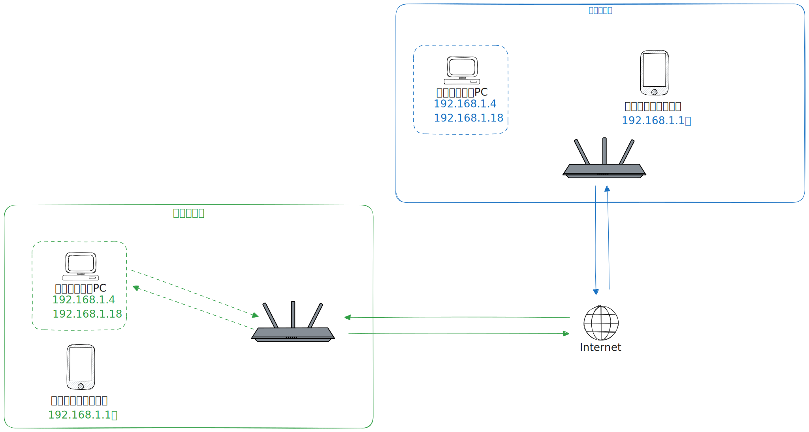

---

# NAT (Network Address Translation)

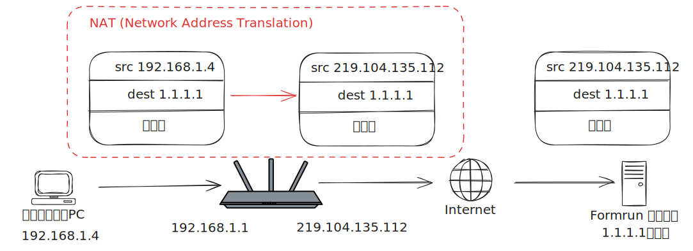

---

# ルートテーブル

基本的にはデバイスが直接接続していない.<br>
そのため, ルーターを使って通信する

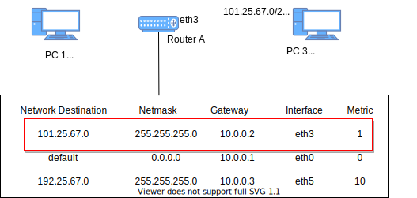

参考: [AWS VPC ルートテーブル](https://docs.aws.amazon.com/ja_jp/vpc/latest/userguide/VPC_Route_Tables.html)

---
layout: center
---

# 謎を解く時間

---
layout: two-cols-header
---

# localhost アクセス？

::left::

<div v-click="1">
  cat /etc/hosts
  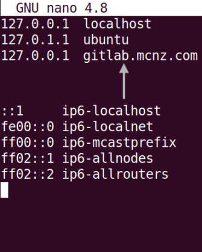

  ifconfig
  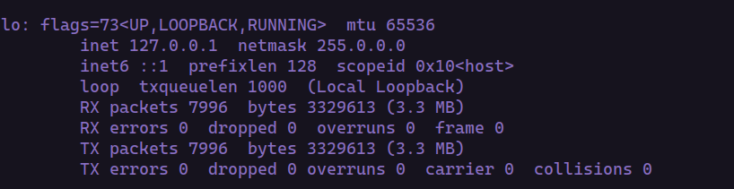

  loopback はルーティング必要ない
</div>

::right::

<div v-click="2">
  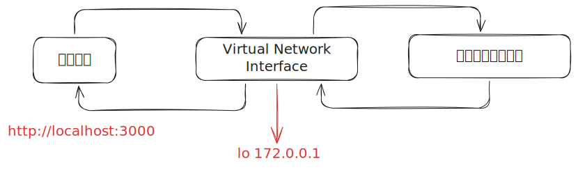
</div>

<style>
.col-header {
  height: 60px;
}
</style>

---
layout: two-cols-header
---

# なぜロカールで webhook が使えない？

::left::


::right::

- localhost はインターネット上でアクセスできない

<div v-click="1"> 方法がある？</div>
<div class="p-2" v-click="2">
  ngrok, localtunnel, ... などのサービスを使う
</div>

<div class="p-2" v-click="3">
  公開 IP アドレスを使う
</div>

---

# ngrok, localtunnel などのサービス


---

# 公開 IP アドレスを使う

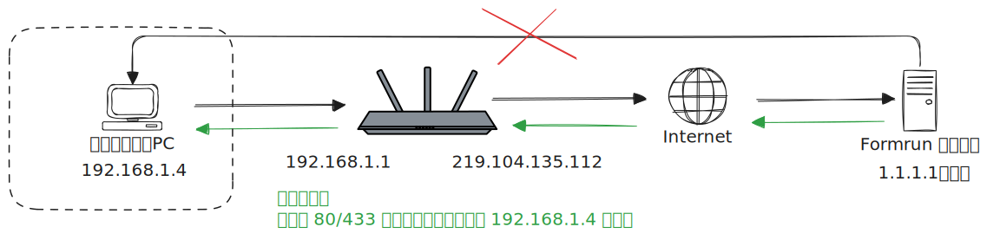

---
layout: two-cols-header
---
# Docker コンテナーに接続できない？

::left::

````md magic-move
```yaml{*|4-5|8-9|10-12}
services:
  web_app1:
    image: alpine:latest
    networks:
      - web_app1
  db1:
    image: alpine:latest
    networks:
      - web_app1
networks:
  web_app1:
    driver: bridge  
```
````

::right::

````md magic-move
```yaml{*|4-5|8-9|12-13|14-16}
services:
  web_app2:
    image: alpine:latest
    networks:
      - web_app2
  db2:
    image: alpine:latest
    networks:
      - web_app2
  redis2:
    image: alpine:latest
    networks:
      - web_app2
networks:
  web_app2:
    driver: bridge
```
````

<style>
  .two-cols-header {
    gap: 4px;
  }
</style>

---

# Docker コンテナーに接続できない？

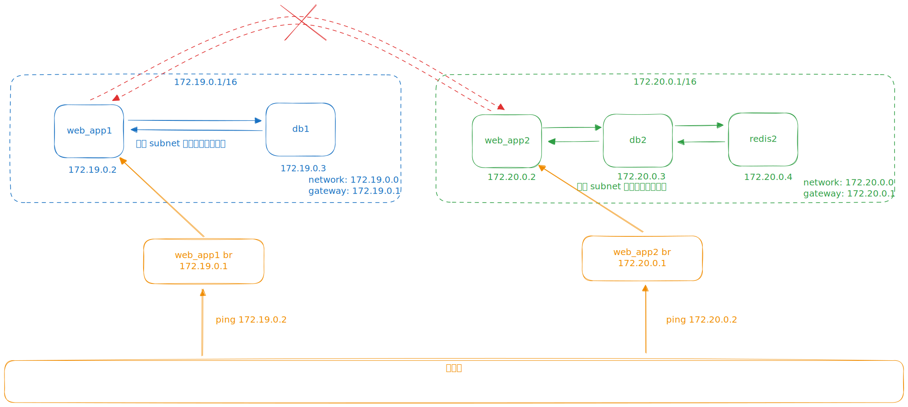

---
layout: center
---

# 終わり
